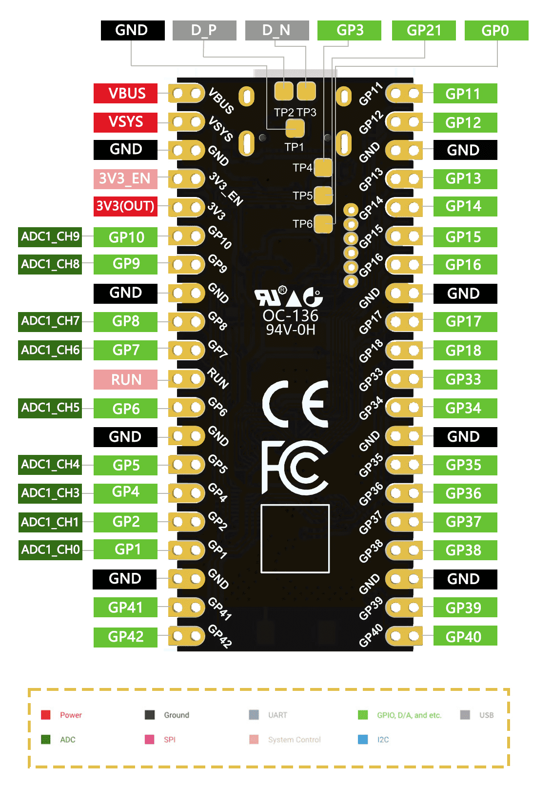
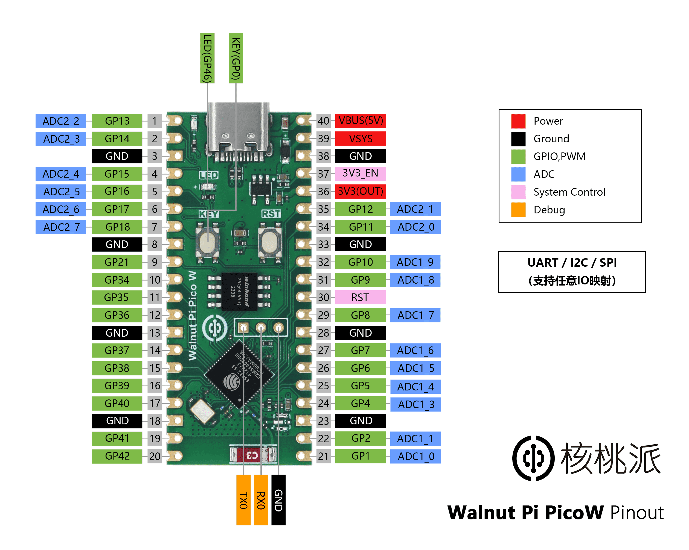

# makerfabs-parallel-tft-lvgl-lgfx porting for Pico_DM_QD3503728

The original project is: [https://github.com/radiosound-com/makerfabs-parallel-tft-lvgl-lgfx](https://github.com/radiosound-com/makerfabs-parallel-tft-lvgl-lgfx)

- Currently Supported Devices - For Comparison click [here](#currently-supported-devices)
  - [Makerfabs 16Bit Parallel TFT 3.5" ILI9488 - ESP32-S3](https://bit.ly/ESP32S335D)
  - [embeddedboys 16-bit 8080 TFT 3.5" ILI9488 display expansion board](https://gf.bilibili.com/item/detail/1105188098)
- Graphics & Touch Driver : [LovyanGFX](https://github.com/lovyan03/LovyanGFX)
- UI / Widgets : [LVGL 9.1.0](https://github.com/lvgl/lvgl)
- Framework : [ESP-IDF 5.2.3](https://github.com/espressif/esp-idf/)

## Get started

### 1. Clone project and update submodules
```bash
git clone https://github.com/radiosound-com/makerfabs-parallel-tft-lvgl-lgfx
cd makerfabs-parallel-tft-lvgl-lgfx
git submodule update --init
```

### 2. Setup

Tested with ESP-IDF v5.2.3. Other versions may work as well.

Make sure you have esp-idf exported, e.g.:

```sh
source ~/esp/esp-idf/export.sh
```

<!-- Depending on which board you have:

```sh
idf.py set-target esp32s2
```

or -->

```sh
idf.py set-target esp32s3
```

### 3. Configuration and Build

This project is designed to be compatible with multiple core board configurations, you need to open `main/LGFX_MakerFabs_Parallel_S3.hpp` and modify `DEFAULT_CORE_BOARD_MODEL` to suit your core board. Here are some options for reference:

- [Nologo tech ESP32-S3 Pico](https://www.nologo.tech/product/esp32/esp32s3/esp32s3Pico/esp32S3Pico.html)
- [Walnutpi PicoW](https://walnutpi.com/docs/walnutpi_picow/)
- [Unknown ESP32 S3 Dev Board A](https://item.taobao.com/item.htm?_u=21m6r7hse5f8&id=749667421699)

```c
#define NOLOGO_ESP32S3_PICO   1
#define WALNUTPI_PICOW        2
#define UNKNOWN_ESP32S3_PICO  3

#ifndef DEFAULT_CORE_BOARD_MODEL
  #define DEFAULT_CORE_BOARD_MODEL NOLOGO_ESP32S3_PICO
#endif
```

```sh
idf.py build flash monitor
```

## Pinouts

### [Nologo tech ESP32-S3 Pico](https://www.nologo.tech/product/esp32/esp32s3/esp32s3Pico/esp32S3Pico.html)


### [Walnutpi PicoW](https://walnutpi.com/docs/walnutpi_picow/)


### [Unknown ESP32 S3 Dev Board A](https://item.taobao.com/item.htm?_u=21m6r7hse5f8&id=749667421699)

```c
  #define TFT_PIN_BLK   9
  #define TFT_PIN_WR    3
  #define TFT_PIN_RD    41
  #define TFT_PIN_RS    4
  #define TFT_PIN_RST   6

  #define TFT_PIN_D0    43
  #define TFT_PIN_D1    44
  #define TFT_PIN_D2    38
  #define TFT_PIN_D3    39
  #define TFT_PIN_D4    40
  #define TFT_PIN_D5    41
  #define TFT_PIN_D6    42
  #define TFT_PIN_D7    21
  #define TFT_PIN_D8    20
  #define TFT_PIN_D9    19
  #define TFT_PIN_D10   18
  #define TFT_PIN_D11   17
  #define TFT_PIN_D12   14
  #define TFT_PIN_D13   13
  #define TFT_PIN_D14   12
  #define TFT_PIN_D15   11

  #define TP_PIN_SDA    7
  #define TP_PIN_SCL    8
  #define TP_PIN_INT    5
```

## Credits

* sukesh-ak's WT32-SC01 project: https://github.com/sukesh-ak/LVGL8-WT32-SC01-IDF
* LovyanGFX's panel/touch/light definitions for the MakerFabs S2 screen: https://github.com/lovyan03/LovyanGFX/blob/master/src/lgfx_user/LGFX_ESP32S2_MakerabsParallelTFTwithTouch.hpp
* MakerFabs' definitions for the S3 screen: https://github.com/Makerfabs/Makerfabs-ESP32-S3-Parallel-TFT-with-Touch/blob/main/firmware/SD16_3.5/SD16_3.5.ino